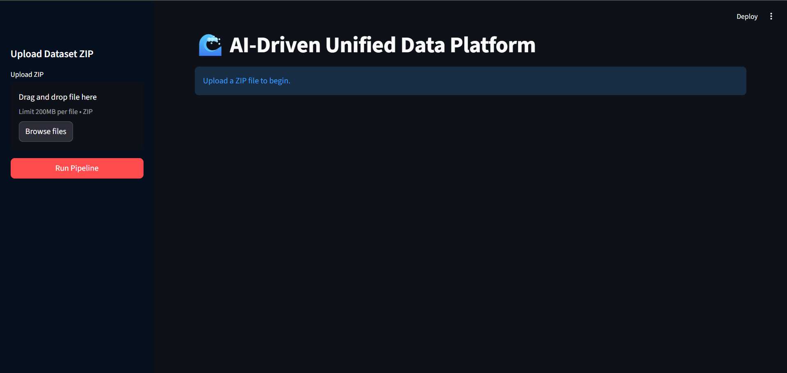
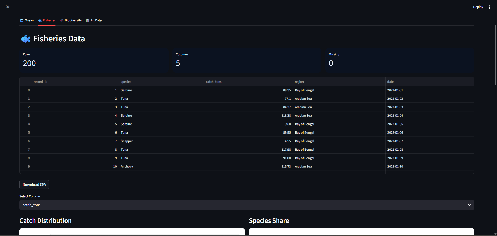
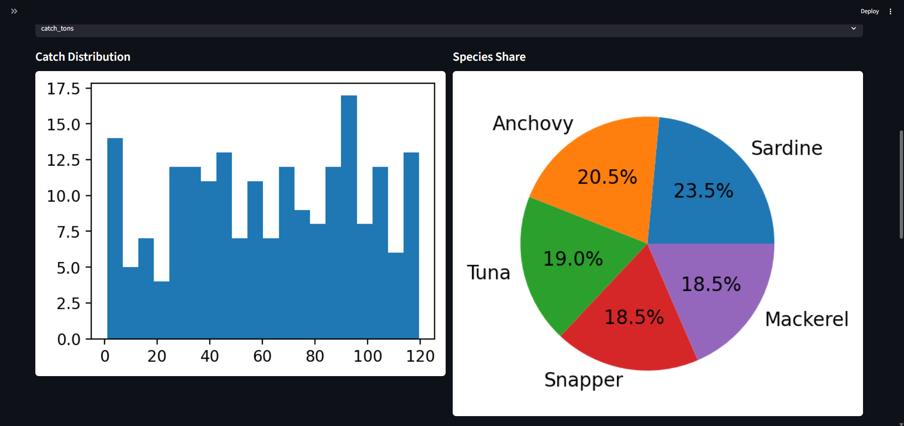
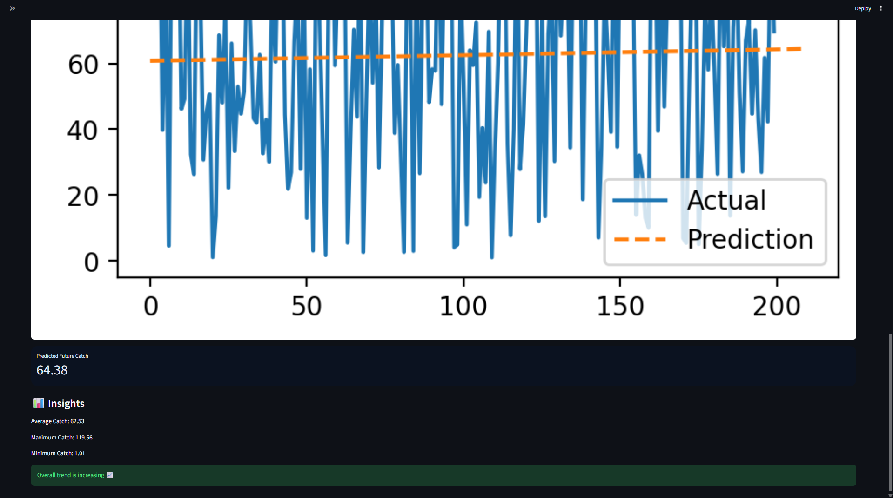
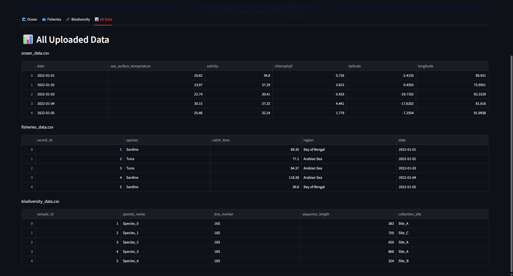

# 🌊 Marine Analytics AI

An AI-powered platform for integrating oceanographic, fisheries, and biodiversity datasets with interactive analytics and predictive modeling.

## Overview

This project integrates Oceanographic, Fisheries, and Biodiversity datasets into a unified interactive dashboard.

## Features

- Multi-dataset upload (ZIP)
- Data cleaning and processing pipeline
- Interactive visualizations (charts, maps)
- Fish catch prediction using regression
- Automated insight generation
- Dataset export functionality

## Tech Stack

- Python
- Pandas
- NumPy
- Streamlit
- Matplotlib

## How to Run

```bash
pip install -r requirements.txt
streamlit run main.py
```

## ZIP Upload Format

Upload a ZIP file containing your datasets.

Recommended naming:

- `*ocean*` → Oceanographic data
- `*fisher*` → Fisheries data
- `*biodiv*` or `*molecular*` → Biodiversity data

If filenames don't match these patterns, datasets will still appear under **All Files**.
## Screenshots

### Dashboard


### Fisheries Data


### Fisheries Charts


### Prediction Results


### All Data View

